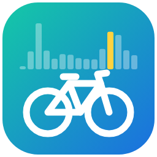

# Vélos Montpellier — intégration Home Assistant

Comptages des éco-compteurs vélo/piéton de Montpellier Méditerranée Métropole, via le
[portail API open data](https://portail-api.montpellier.fr/) (NGSI-LD, sans clé).

> ⚠️ Les données ne sont **pas** temps réel : chaque compteur publie ses comptages
> horaires en différé, avec **8 à 30 h de retard** selon l'appareil.

## Fonctionnement

- **Configuration** : liste des compteurs ayant publié dans les 7 derniers jours, triés
  par distance au domicile ; sélection multiple. Modifiable ensuite dans les options.
- **Mise à jour** : toutes les 30 min, une seule requête pour tous les compteurs suivis
  (fenêtre glissante de 5 jours).
- **Par compteur** (un appareil chacun) :

  | Capteur | Valeur | Attributs |
  |---|---|---|
  | Dernier jour complet | Total de la dernière journée dont les 24 heures sont publiées | `date`, coordonnées |
  | Dernière heure publiée | Passages pendant la dernière heure disponible | `observed_at` |
  | Dernière donnée *(diagnostic)* | Horodatage de la dernière heure publiée | |

- **Statistiques externes** `velos_montpellier:<numéro de série>` : chaque comptage
  horaire est importé **à sa vraie date** (l'historique d'état des capteurs, lui, les
  daterait à leur réception). L'historique des N derniers jours (option, 30 par défaut)
  est rattrapé au premier chargement. À afficher avec la carte *Graphique de
  statistiques* (période jour/semaine/mois, type « changement »).

## Particularités de l'API (vérifiées)

- Les horodatages `…Z` sont en réalité en **heure de Paris** (la somme des heures
  00h–23h correspond au total journalier officiel). La source publie 24 valeurs par jour
  même lors des changements d'heure : on range par heure UTC en additionnant les
  collisions.
- Chaque compteur envoie ses données par paquets de 24 h, coupés à une heure qui lui
  est propre (00h, 02h, 05h, 22h…). Tous les 4 à 5 jours, un paquet est perdu et
  n'est jamais republié : certaines journées restent partielles. Elles sont ignorées
  par le capteur *Dernier jour complet* ; les statistiques gardent les heures reçues.
- Sur les 70 compteurs déclarés, environ 18 n'émettent plus (remplacés ou hors service).
  Les remplaçants portent une relation `oldVersion`.
- Certains compteurs n'ont pas de nom : on affiche « Compteur <numéro de série> ».
- `portail-api-data.montpellier.fr` répond ; `…montpellier3m.fr` sert de secours.
- Les anciens endpoints (`/ecocounter…`) disparaissent le 31/12/2026 et ne sont pas
  utilisés.

## Installation

Copier `custom_components/velos_montpellier` dans le dossier `config/custom_components`
de Home Assistant (ou ajouter `https://github.com/3615nulsi/velos_montpellier` comme dépôt personnalisé
HACS, catégorie *Intégration*), redémarrer, puis
*Paramètres → Appareils et services → Ajouter une intégration → Vélos Montpellier*.

## Pistes / TODO

- Relier la statistique d'un compteur renommé à celle de son prédécesseur (`oldVersion`).
- Une heure publiée *après* une heure plus récente déjà importée est ignorée ;
  à surveiller sur des données réelles.
- Nettoyer les statistiques d'un compteur retiré de la sélection.
- Capteurs agrégés (total de plusieurs compteurs, ex. les deux sens d'un axe).
