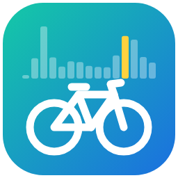

# Vélos Montpellier — intégration Home Assistant

Fréquentation des pistes cyclables de Montpellier Méditerranée Métropole : total
journalier de passages de chaque éco-compteur, tiré des
[fichiers open data](https://data.montpellier3m.fr/dataset/comptages-velo-et-pieton-issus-des-compteurs-de-velo)
de la Métropole (même source que [compteurs.velocite-montpellier.fr](https://compteurs.velocite-montpellier.fr/)).

> ⚠️ Les données ne sont **pas** temps réel : le total d'une journée est publié le
> lendemain soir.

## Fonctionnement

- **Configuration** : liste des compteurs ayant publié dans les 7 derniers jours, triés
  par distance au domicile ; sélection multiple. Modifiable ensuite dans les options.
- **Mise à jour** : toutes les heures, lecture du petit fichier « dernier jour » de
  chaque compteur suivi.
- **Par compteur** (un appareil chacun), un capteur *Dernier jour* : total du dernier
  jour publié, avec sa `date` et les coordonnées du compteur en attributs.
- **Statistiques externes** `velos_montpellier:<numéro de série>` : un total par jour,
  daté de minuit (l'historique d'état du capteur, lui, le daterait à sa réception).
  À chaque démarrage, l'historique des N derniers jours (option, 365 par défaut) est
  relu dans l'archive du compteur et réimporté ; elle est aussi relue s'il manque des
  jours (Home Assistant arrêté). À afficher avec la carte *Graphique de statistiques*
  (période jour/semaine/mois, type « changement »).

## Particularités des données (vérifiées)

- **Pourquoi pas les comptages horaires du portail API ?** Chaque compteur y envoie ses
  données par paquets de 24 h, et environ un paquet sur trois à cinq est perdu sans
  jamais être republié : sur 40 jours, seuls 17 à 28 sont complets selon le compteur.
  Les fichiers open data ont, eux, 39 à 40 jours sur 40 et concordent avec l'API les
  jours où elle est complète (à 1-3 % près pour les compteurs `ZLT…`, dont le fichier
  omet souvent les heures 22h-23h).
- Les fichiers sont des objets JSON mis bout à bout, parfois collés, tronqués ou sans
  total (`null`) : ils sont lus avec un analyseur tolérant.
- Un même jour apparaît parfois deux fois ; la seconde valeur est un enregistrement
  parasite (la même valeur chez plusieurs compteurs) : la première fait foi.
- Les fichiers sont réécrits chaque soir et peuvent être servis vides ou tronqués
  pendant la réécriture : une archive qui s'arrête trop tôt n'écrase pas l'historique.
- Le portail API (NGSI-LD) sert encore à lister les compteurs, leurs noms et leurs
  coordonnées. Sur les 70 compteurs déclarés, environ 18 n'émettent plus ; certains
  n'ont pas de nom (« Compteur <numéro de série> »).

## Installation

Copier `custom_components/velos_montpellier` dans le dossier `config/custom_components`
de Home Assistant (ou ajouter `https://github.com/3615nulsi/velos_montpellier` comme dépôt personnalisé
HACS, catégorie *Intégration*), redémarrer, puis
*Paramètres → Appareils et services → Ajouter une intégration → Vélos Montpellier*.

## Pistes / TODO

- Relier la statistique d'un compteur renommé à celle de son prédécesseur (`oldVersion`).
- Nettoyer les statistiques d'un compteur retiré de la sélection.
- Capteurs agrégés (total de plusieurs compteurs, ex. les deux sens d'un axe).
